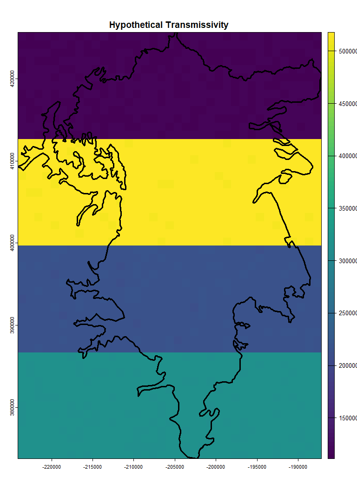
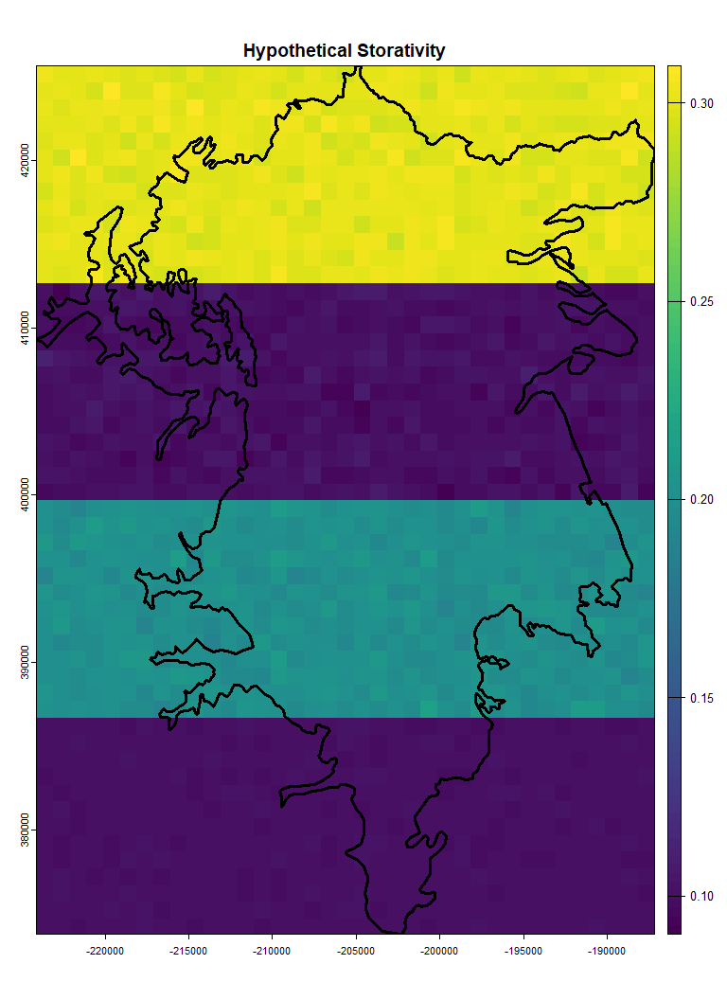
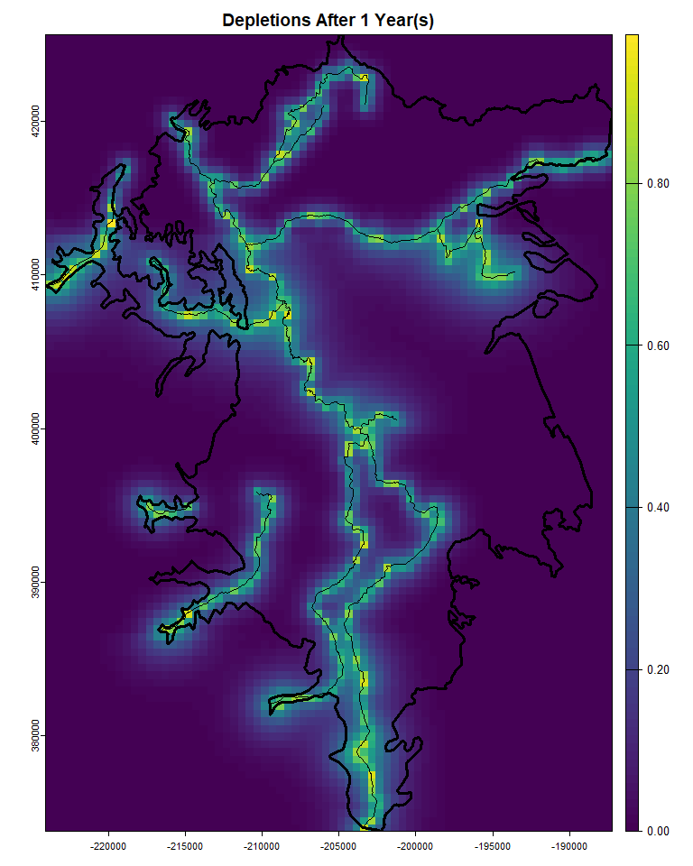
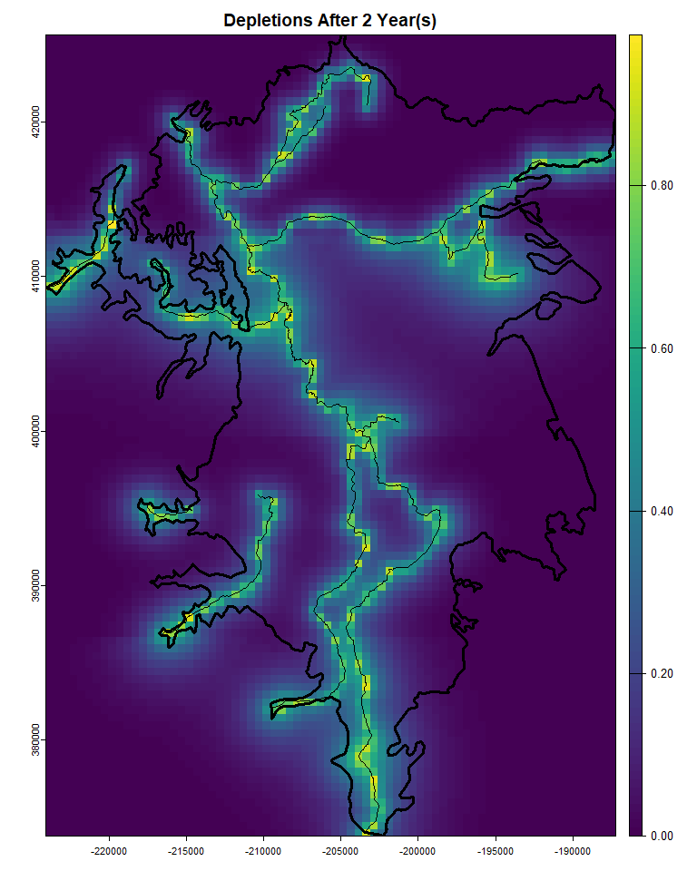
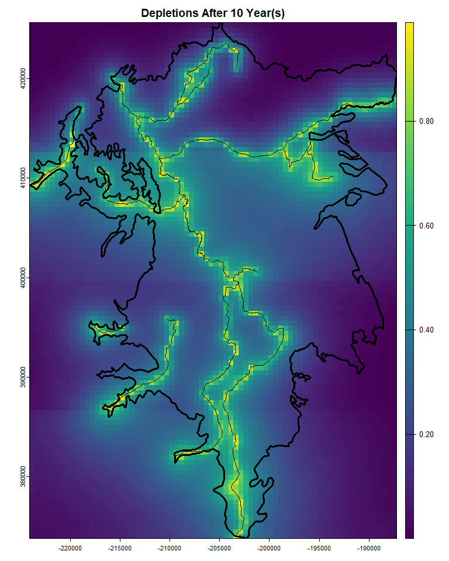
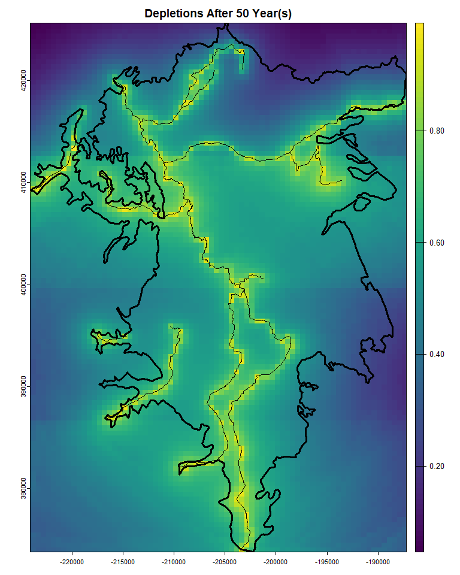

Analytical_Depletion_Example
================
Christopher Dory
2025-11-05

# Introduction

This will be an example of how to calculate stream depletions using the
fastest method <br/> from Zipper et
al. (<https://doi.org/10.1029/2018WR024403>). The fastest method uses
the ‘local area’ proximity criteria, the ‘inverse distance’
apportionment method, and the ‘glover’(glover-balmer) analytical model.
<br/> <br/> For this we will first load in the following files: <br/>
Shasta groundwater basin <br/> Shasta streams <br/> <br/> And then
assign an ‘influence radius’ to a series of randomly generated wells in
the domain <br/> The influence radius describes the radius over which a
well is expected to produce meaningful <br/> depletion. It is defined by
Zipper et al. (2019) to be twice the maximum distance from <br/> any
land point within the domain to its closest stream segment. <br/> This
ensures that each well has 1 \>= segment associated with it. <br/> <br/>
<br/> **NOTES** <br/> 1) Though the program will attempt to correct
differing projections, it is best if they <br/>     are projected
beforehand.<br/> 2) To avoid depletions predicted for inappropriate
locations, please pre-process streams <br/>     so that they are only
within the groundwater basin <br/> 3) The author is aware that the
Shasta groundwater basin has complex geology, which is not matched
by<br/>     the aquifer properties assigned below. This is simply an
example.<br/>

``` r
Shasta_Streams <- st_read(file.path(here::here(),
                                    'Data',
                                    'Shapefiles',
                                    'shasta_mainstreams.shp'), quiet = TRUE)
Shasta_Streams <- st_zm(Shasta_Streams)
Shasta_B118 <- st_read(file.path(here::here(),
                                 'Data',
                                 'Shapefiles',
                                 'Bulletin 118 Boundary_shasta.shp'), quiet = TRUE)
Shasta_B118 <- st_transform(Shasta_B118, 3310)
Shasta_Streams <- st_intersection(Shasta_Streams, Shasta_B118$geometry)
```

<br/> <br/> <br/> <br/> <br/> <br/>

# Local Area Criteria

To implement Zippers ‘Local Area’ criteria we will create a 1km grid
over the domain, <br/> take the centroids of those grid cells, clip them
by the groundwater basin <br/> calculate the distance of each centroid
to its closest stream, and then <br/> take double the maximum<br/> <br/>
1km was chosen due to computing power limitations<br/> Grid size will
change results slightly, but by increasing the number of grid<br/> cells
by 100 the result only changes by about 1%<br/>

``` r
#-------------------------------------------------------------------------------
# make grid and centroids
grid <- st_make_grid(Shasta_B118,
                     cellsize = 1000)

centroids <- st_centroid(grid)
centroids <- st_intersection(centroids, Shasta_B118$geometry)
#-------------------------------------------------------------------------------

#-------------------------------------------------------------------------------
# find influence radius
dist_matrix <- st_distance(centroids, Shasta_Streams)
diag(dist_matrix) <- NA
min_distances <- apply(dist_matrix, 1, min, na.rm = TRUE)

influence_radius <- max(min_distances)*2
#-------------------------------------------------------------------------------
```

<br/> <br/> For Shasta the influence radius is calculated <br/> here as
20 kilometers. <br/>

<!-- --> <br/> The influence
radius calculated here is nearly equivalent to the ‘whole domain’
proximity criteria, where each well is considered to have some, even if
vanishingly small, potential to effect each stream. In the study area of
Zipper et al. (2019), the Navarro River Watershed, streams are more
evenly distributed than they are in the Shasta Valley, yielding a
smaller (and more reasonable) influence radius. <br/> <br/> However, as
we will see in the following section, just because a stream is within
the influence radius of a well does not mean a notable amount of
depletion are apportioned to it. Proximate streams will always be
prioritized over farther ones, and its likely that far reaches will have
\<\< 1% of the wells pumping assigned to them. <br/> <br/> Furthermore,
analytical solutions such as the Glover-Balmer solution (1954) take
distance as an argument. And so even in the extreme case that there is
one stream and one well separated by an inordinate distance, say 100km,
while all of the wells pumping will be assigned to the stream the
distance is such that the depletion fraction wouldn’t be noticeable on a
human timescale. <br/> <br/> This is not to say that the proximity
criteria arguments are moot, as small errors can compound if there are
many streams and many wells each with slight mis-assignments, but rather
that the variance in model scenarios is likely to be the volume of
depletion on an individual reach and not the identification of the most
impacted reach. This conclusion is corroborated by figure 4 of Zipper et
al. (2019). <br/> <br/> <br/> <br/> <br/> <br/>

# Depletion Apportionment Criteria

For the depletion apportionment criteria here we will use inverse
distance. This is defined by the following equation:<br/>
$$\Large f_{(r,w)} = \frac{\frac{1}{d_{(r,w)}^W}}{\sum_{j=1,n} \frac{1}{d_{(r_{j},w)}^W}}$$
<br/>     Where:<br/>          $f_{(r,w)} [-]=$ the fraction of the
depletion potential from well ‘w’ assigned to reach ‘r’<br/>         
$d_{(r,w)} [L]=$ the distance of well ‘w’ to reach ‘r’<br/>         
$W =[-]$ the power of the equation (1 for inverse distance, 2 for
inverse distance squared)<br/>         
$\sum_{j = 1,n} \frac{1}{d_{(r_{j},w)}^W} [L]=$ the sum of the distances
from well ‘w’ to all reaches (j = 1,n) assigned to it<br/><br/>

### Example

<br/> We have a well ‘w’ that is connected to four reaches, ‘A’,‘B’,‘C’
that are distances 10,40,50 from the well. Using the above formula we
would arrive at the following for reach ‘A’.<br/>
$$\Large f_{(A,w)} = \frac{0.1}{0.1 + 0.025 + 0.02} = 0.689$$ <br/> So
we see that the closest reach ‘A’ is apportioned the lions share of
whatever depletions are calculated from well ‘w’. No matter what
depletion apportionment we use, the sum should always equal to 1. <br/>
<br/> <br/> <br/> <br/> <br/>

# Depletion Analytical Model

This example will, as mentioned, use the Glover-Balmer solution of
Glover and Balmer (1954) <https://doi.org/10.1029/TR035i003p00468>.<br/>
Their equation is based on the earlier work of Theis in potentiometric
surface drawdown from groundwater pumping, and assumes (in contrast to
later, more computationally demanding methods) a linear stream that
fully penetrates the aquifer with no streambed clogging layer. Their
analytical solution is then multiplied by the fraction $f_{(r,w)}$
derived above.

$$\Large Q_{(r,w)} = Q_{w}*\text{erfc} \LARGE (\Large\sqrt{\frac{Sd_{(r,w)}^2}{4Tt}}\LARGE) \Large * f_{(r,w)}$$

<br/>     Where:<br/>          $Q_{(r,w)} [\frac{L^3}{T}]=$ the
cumulative depletion experienced by reach r as a result of well w<br/>
         $Q_{w} [\frac{L^3}{T}]=$ the pumping rate of well w<br/>
         $\text{erfc} [-]=$ the complimentary error function, as the
value inside approaches 0 it will return 1<br/>         
$S [\frac{L}{L}]=$ the storativity of the aquifer<br/>         
$d_{(r,w)}^2 [L]=$ the distance between the reach and the well
squared<br/>          $T [\frac{L^2}{T}]=$ the transmissivity of the
aquifer, described also as the thickness of the aquifer multiplied by
its conductivity $(bK)$ <br/>          $t [T]=$ the time at which the
equation is to be evaluated<br/>

<font size = '4'>**Important Note**</font><br/> While technically any
units can be used, if the spatial projection of the data is one
typically used (such as NAD83) the length units when distances are
calculated will be in meters. Therefore the user should convert all
units into metric beforehand (such as gallons per day to cubic meters
per day). <br/> <br/>

### Example

For our example we’ll just assign some arbitrary numbers for
storativity, and transmissivity. The exact values aren’t important at
this moment, but demonstrating the correct format for them is. Pumping
will just be a vector of years to evaulate the function at. Because the
numbers we assigned in this example for transmissivity represent
$\frac{L^2}{\text{year}}$ the timesteps passed to pumping also must
represent years

``` r
r <- rast(ncols = 37,
          nrows = 52,
          xmin = st_bbox(Shasta_B118)['xmin'], xmax = st_bbox(Shasta_B118)['xmax'],
          ymin = st_bbox(Shasta_B118)['ymin'], ymax = st_bbox(Shasta_B118)['ymax'],
          crs = "EPSG:3310")
values(r) <- rev(model_grid$Tr)
plot(r, main = 'Hypothetical Transmissivity')
plot(st_geometry(Shasta_B118), add = T, lwd = 3)
```

<!-- -->

``` r
r <- rast(ncols = 37,
          nrows = 52,
          xmin = st_bbox(Shasta_B118)['xmin'], xmax = st_bbox(Shasta_B118)['xmax'],
          ymin = st_bbox(Shasta_B118)['ymin'], ymax = st_bbox(Shasta_B118)['ymax'],
          crs = "EPSG:3310")
values(r) <- rev(model_grid$Stor)
plot(r, main = 'Hypothetical Storativity')
plot(st_geometry(Shasta_B118), add = T, lwd = 3)
```

<!-- -->

``` r
pumping <- c(1,2,10,50) # years after which to evaluate the functions
```

``` r
map_stream_depletions(streams = Shasta_Streams,
                      well_grid_ext = st_bbox(Shasta_B118),
                      well_grid_cellsize = 500,
                      well_layer = 1,
                      well_crs = 3310,
                      model_grid = model_grid,
                      custom_sdf_time = 0.5, # time where depletions equal half pumping rate
                      pumping = pumping,
                      influence_radius = influence_radius, # influence radius calculated above
                      proximity_criteria = 'local area',
                      apportionment_criteria = 'inverse distance',
                      analytical_model = 'glover',
                      data_out_dir = file.path(getwd(),'Output'),
                      diag_out_dir = file.path(getwd(),'Output'),
                      suppress_loading_bar = TRUE,
                      suppress_console_messages = TRUE,
                      grid_layer_key = 'lay',
                      grid_stor_coef_key = 'Stor', # where to find storage coef in well set
                      grid_transmissivity_key = 'Tr') # where to find transmissivity in well set
```

<br/> <br/> <br/> <br/> <br/> <br/>

# Results

<br/> In our example we can look to see when the depletions caused by
each well equal to 0.5 percent of its pumping rate. This should normally
be masked by the user to only within the groundwater basin but is not
here for demonstration purposes that all wells within the domain are
simulated.<br/> <br/> As expected, this time is lowest closest to
streams, and where there is a combination of high transmissivity and low
storativity (second band from the top).<br/> <br/>

<font size = '4'>**Important Note**</font><br/>

As is stated in the assumptions documentation, analytical solutions to
stream depletion assume that the aquifer extends equally in all
directions. Therefore when wells are simulated against the groundwater
basin boundaries, these equations likely underestimate depletions. This
is due to the fact that the cone of depression of the well can only
expand in one direction, away from the boundary and towards the interior
of the basin where the streams are located. To match the pumping rate
with only half of the aquifer area to take from, the cone of depression
must expand more quickly, and this dynamic is simply not able to be
simulated by analytical solutions.<br/> <br/> It is ultimately up to the
user to mask areas that are not appropriate. For example, the protrusion
area around 41000 N and -215000 E it may be appropriate to make a
disclaimer that this area is underestimated.

<!-- -->

<br/> <br/> <br/> Over time, as the cone of depression expands out from
each well we see that after 50 years nearly every well within the domain
will be taking grater than or equal to 50% of its pumped water from
stream depletions.<br/> <br/> This fits well within the statements of
Barlow and Leake (2012) and numerous other publications who state that
pumping from a well must eventually come from either a reduction in
discharges or an increases in reacharges to the watershed.
<!-- --><!-- --><!-- --><!-- -->
