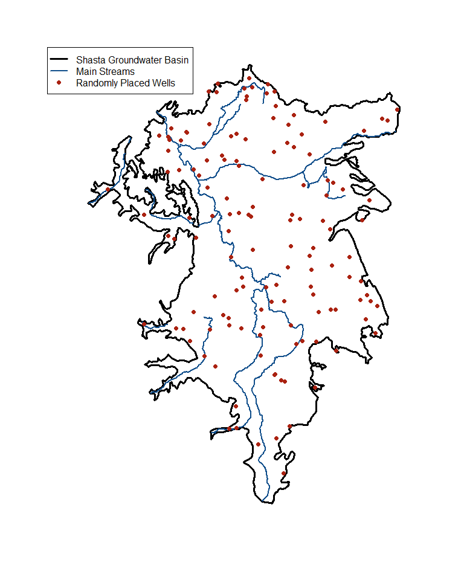
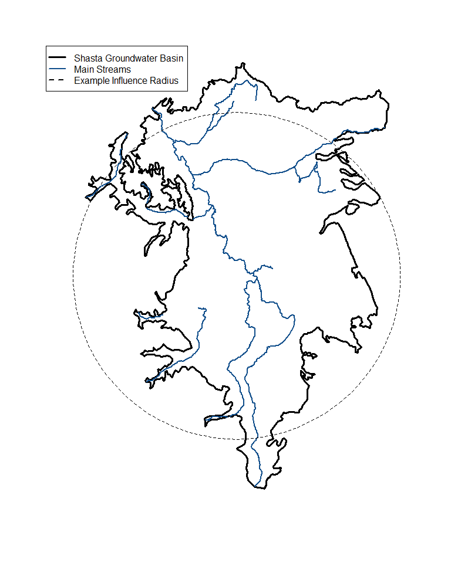
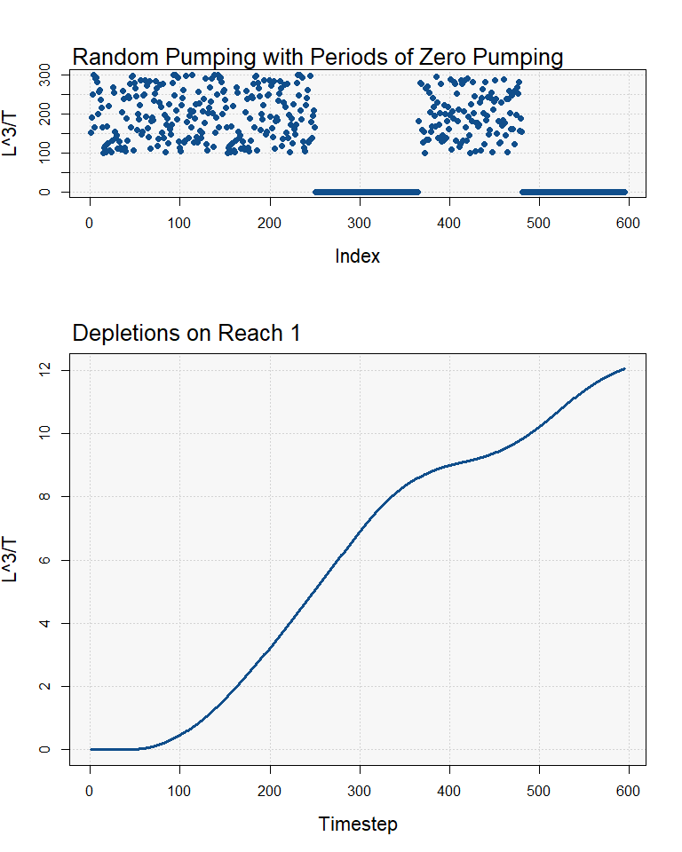

Analytical_Depletion_Example
================
Christopher Dory
2025-11-05

# Introduction

This will be an example of how to calculate stream depletions using the
fastest method <br/> from Zipper et
al. (<https://doi.org/10.1029/2018WR024403>). The fastest method uses
the ‘local area’ proximity criteria, the ‘inverse distance’
apportionment method, and the ‘glover’(glover-balmer) analytical model.
<br/> <br/> For this we will first load in the following files: <br/>
Shasta groundwater basin <br/> Shasta streams <br/> <br/> And then
assign an ‘influence radius’ to a series of randomly generated wells in
the domain <br/> The influence radius describes the radius over which a
well is expected to produce meaningful <br/> depletion. It is defined by
Zipper et al. (2019) to be twice the maximum distance from <br/> any
land point within the domain to its closest stream segment. <br/> This
ensures that each well has 1 \>= segment associated with it. <br/> <br/>
<br/> **NOTES** <br/> 1) Though the program will attempt to correct
differing projections, it is best if they <br/>     are projected
beforehand.<br/> 2) To avoid depletions predicted for inappropriate
locations, please pre-process streams <br/>     so that they are only
within the groundwater basin <br/>

``` r
Shasta_Streams <- st_read(file.path(here::here(),
                                    'Data',
                                    'Shapefiles',
                                    'shasta_mainstreams.shp'), quiet = TRUE)
Shasta_Streams <- st_zm(Shasta_Streams)
Shasta_B118 <- st_read(file.path(here::here(),
                                 'Data',
                                 'Shapefiles',
                                 'Bulletin 118 Boundary_shasta.shp'), quiet = TRUE)
Shasta_B118 <- st_transform(Shasta_B118, 3310)
Shasta_Streams <- st_intersection(Shasta_Streams, Shasta_B118$geometry)
```

``` r
bb <- st_bbox(Shasta_B118)
set.seed(1)
x <- runif(n = 300, min = bb['xmin'], max = bb['xmax'])
y <- runif(n = 300, min = bb['ymin'], max = bb['ymax'])
random_wells <- cbind(x,y) %>% as.data.frame()
random_wells <- st_as_sf(random_wells,
                         coords = c('x','y'),
                         crs = st_crs(Shasta_B118),
                         na.fail = FALSE)
random_wells <- st_intersection(random_wells,
                                Shasta_B118$geometry)
```

<!-- -->

<br/> <br/> <br/> <br/> <br/> <br/>

# Local Area Criteria

To implement Zippers ‘Local Area’ criteria we will create a 1km grid
over the domain, <br/> take the centroids of those grid cells, clip them
by the groundwater basin <br/> calculate the distance of each centroid
to its closest stream, and then <br/> take double the maximum<br/> <br/>
1km was chosen due to computing power limitations<br/> Grid size will
change results slightly, but by increasing the number of grid<br/> cells
by 100 the result only changes by about 1%<br/>

``` r
#-------------------------------------------------------------------------------
# make grid and centroids
grid <- st_make_grid(Shasta_B118,
                     cellsize = 1000)

centroids <- st_centroid(grid)
centroids <- st_intersection(centroids, Shasta_B118$geometry)
#-------------------------------------------------------------------------------

#-------------------------------------------------------------------------------
# find influence radius
dist_matrix <- st_distance(centroids, Shasta_Streams)
diag(dist_matrix) <- NA
min_distances <- apply(dist_matrix, 1, min, na.rm = TRUE)

influence_radius <- max(min_distances)*2
#-------------------------------------------------------------------------------
```

<br/> <br/> For Shasta the influence radius is calculated <br/> here as
20 kilometers. <br/> The below visualization shows wells, with their
sized scaled by the length of river <br/> that they effect relative to
the maximum length. <br/> As expected, those at the periphery effect
less reach. <br/>

<!-- --> <br/> The influence
radius calculated here is nearly equivalent to the ‘whole domain’
proximity criteria, where each well is considered to have some, even if
vanishingly small, potential to effect each stream. In the study area of
Zipper et al. (2019), the Navarro River Watershed, streams are more
evenly distributed than they are in the Shasta Valley, yielding a
smaller (and more reasonable) influence radius. <br/> <br/> However, as
we will see in the following section, just because a stream is within
the influence radius of a well does not mean a notable amount of
depletion are apportioned to it. Proximate streams will always be
prioritized over farther ones, and its likely that far reaches will have
\<\< 1% of the wells pumping assigned to them. <br/> <br/> Furthermore,
analytical solutions such as the Glover-Balmer solution (1954) take
distance as an argument. And so even in the extreme case that there is
one stream and one well separated by an inordinate distance, say 100km,
while all of the wells pumping will be assigned to the stream the
distance is such that the depletion fraction will never be noticeable.
<br/> <br/> This is not to say that the proximity criteria arguments are
moot, as small errors can compound if there are many streams and many
wells each with slight mis-assignments, but rather that the variance in
model scenarios is likely to be the volume of depletion on an individual
reach and not the identification of the most impacted reach. This
conclusion is corroborated by figure 4 of Zipper et al. (2019). <br/>
<br/> <br/> <br/> <br/> <br/>

# Depletion Apportionment Criteria

For the depletion apportionment criteria here we will use inverse
distance. This is defined by the following equation:<br/>
$$\Large f_{(r,w)} = \frac{\frac{1}{d_{(r,w)}^W}}{\sum_{j=1,n} \frac{1}{d_{(r_{j},w)}^W}}$$
<br/>     Where:<br/>          $f_{(r,w)} [-]=$ the fraction of the
depletion potential from well ‘w’ assigned to reach ‘r’<br/>         
$d_{(r,w)} [L]=$ the distance of well ‘w’ to reach ‘r’<br/>         
$W =[-]$ the power of the equation (1 for inverse distance, 2 for
inverse distance squared)<br/>         
$\sum_{j = 1,n} \frac{1}{d_{(r_{j},w)}^W} [L]=$ the sum of the distances
from well ‘w’ to all reaches (j = 1,n) assigned to it<br/><br/>

### Example

<br/> We have a well ‘w’ that is connected to four reaches, ‘A’,‘B’,‘C’
that are distances 10,40,50 from the well. Using the above formula we
would arrive at the following for reach ‘A’.<br/>
$$\Large f_{(A,w)} = \frac{0.1}{0.1 + 0.025 + 0.02} = 0.689$$ <br/> So
we see that the closest reach ‘A’ is apportioned the lions share of
whatever depletions are calculated from well ‘w’. No matter what
depletion apportionment we use, the sum should always equal to 1. <br/>
<br/> <br/> <br/> <br/> <br/>

# Depletion Analytical Model

This example will, as mentioned, use the Glover-Balmer solution of
Glover and Balmer (1954) <https://doi.org/10.1029/TR035i003p00468>.<br/>
Their equation is based on the earlier work of Theis in potentiometric
surface drawdown from groundwater pumping, and assumes (in contrast to
later, more computationally demanding methods) a linear stream that
fully penetrates the aquifer with no streambed clogging layer. Their
analytical solution is then multiplied by the fraction $f_{(r,w)}$
derived above.

$$\Large Q_{(r,w)} = Q_{w}*\text{erfc} \LARGE (\Large\sqrt{\frac{Sd_{(r,w)}^2}{4Tt}}\LARGE) \Large * f_{(r,w)}$$

<br/>     Where:<br/>          $Q_{(r,w)} [\frac{L^3}{T}]=$ the
cumulative depletion experienced by reach r as a result of well w<br/>
         $Q_{w} [\frac{L^3}{T}]=$ the pumping rate of well w<br/>
         $\text{erfc} [-]=$ the complimentary error function, as the
value inside approaches 0 it will return 1<br/>         
$S [\frac{L}{L}]=$ the storativity of the aquifer<br/>         
$d_{(r,w)}^2 [L]=$ the distance between the reach and the well
squared<br/>          $T [\frac{L^2}{T}]=$ the transmissivity of the
aquifer, described also as the thickness of the aquifer multiplied by
its conductivity $(bK)$ <br/>          $t [T]=$ the time at which the
equation is to be evaluated<br/>

<font size = '4'>**Important**</font><br/> While technically any units
can be used, if the spatial projection of the data is one typically used
(such as NAD83) the length units when distances are calculated will be
in meters. Therefore the user should convert all units into metric
beforehand (such as gallons per day to cubic meters per day). <br/>
<br/>

### Example

For our example we’ll just assign some arbitrary numbers for
storativity, transmissivity, and pumping. The exact values aren’t
important at this moment, but demonstrating the correct format for them
is.

``` r
# giving each well some random aquifer parameters
random_wells <- random_wells[,-c(2,3)]

random_wells$Stor <- runif(n = nrow(random_wells),
                           min = 0.02, max = 0.1)
random_wells$Tr <- runif(n = nrow(random_wells),
                         min = 50, max = 200)


# assign pumping to each well
# where each row is a well, each column is a timestep, and each value
# in a row, column pair is the pumping rate at that timestep for that well
pumping <- matrix(runif(n = nrow(random_wells),
                        min = 100,
                        max = 300),
                  nrow = nrow(random_wells),
                  ncol = 250,byrow = TRUE)
pumping <- cbind(pumping, matrix(0,
                                 nrow = nrow(random_wells),
                                 ncol = 115))
pumping <- cbind(pumping, matrix(runif(n = nrow(random_wells),
                                       min = 100,
                                       max = 300),
                                 nrow = nrow(random_wells),
                                 ncol = 115,byrow = TRUE))
pumping <- cbind(pumping, matrix(0,
                                 nrow = nrow(random_wells),
                                 ncol = 115))
```

<br/> <br/> **Pumping Structure**<br/> Each row is a well<br/> Each
column is a timestep<br/> Each row,column combination contains a pumping
rate<br/> <br/> If the timestep is days then each row,column combination
will have the number of $L^3$ pumped in that day.<br/> For visibility
only the first 5 columns are shown here.

    ##            V1       V2       V3       V4       V5
    ##         <num>    <num>    <num>    <num>    <num>
    ##   1: 151.7205 190.9198 248.1953 298.1320 166.4410
    ##   2: 299.9861 205.5564 126.7469 187.7080 224.1588
    ##   3: 125.1458 224.8729 160.4863 147.9274 171.7260
    ##   4: 286.1184 192.5461 272.1382 162.4073 141.6078
    ##   5: 204.4923 257.8463 238.9507 113.3152 103.5915
    ##  ---                                             
    ## 134: 200.9010 215.6965 267.8608 230.8890 288.9057
    ## 135: 127.5461 131.9570 297.7667 179.7291 137.5824
    ## 136: 218.4627 152.4864 276.7505 137.5379 197.7734
    ## 137: 200.3897 185.6694 222.0032 285.2226 148.0247
    ## 138: 154.5561 137.6327 145.1524 112.3941 111.9800

<br/> <br/> **Well Structure**<br/> Wells have a column for aquifer
properties.

    ##                        geometry       Stor        Tr
    ##                     <sfc_POINT>      <num>     <num>
    ##   1: POINT (-202962.2 399323.9) 0.08514014  62.95931
    ##   2: POINT (-190580.2 397712.5) 0.09430218  56.39857
    ##   3:   POINT (-199715.1 415978) 0.03179848 102.31112
    ##   4: POINT (-200884.9 377307.2) 0.07998573 131.35040
    ##   5:   POINT (-198746.8 417427) 0.09805259 141.41913
    ##  ---                                                
    ## 134:   POINT (-191609.9 407322) 0.02406169 196.05900
    ## 135: POINT (-212039.1 407595.1) 0.07719730 172.07087
    ## 136: POINT (-205395.9 416850.5) 0.04381556  83.56516
    ## 137: POINT (-198952.8 407419.2) 0.04267818 123.46135
    ## 138:   POINT (-189803.1 397138) 0.08639017  51.70103

``` r
calculate_stream_depletions(streams = Shasta_Streams,
                            wells = random_wells,
                            pumping = pumping,
                            influence_radius = influence_radius, # influence radius calculated above
                            proximity_criteria = 'local area',
                            apportionment_criteria = 'inverse distance',
                            analytical_model = 'glover',
                            data_out_dir = file.path(getwd(),'Output'),
                            diag_out_dir = file.path(getwd(),'Output'),
                            stor_coef_key = 'Stor', # where to find storage coef in well set
                            well_transmissivity_key = 'Tr') # where to find transmissivity in well set
```

<br/> <br/> <br/> <br/> <br/> <br/>

# Results

<br/> In our example we can look to a random reach to see how our
intermittent pumping effected depletions.<br/> <br/> Of note is that
when pumping is at 0 depletions are still accumulating from pumping,
indicating both a delayed response (as expected) from pumping and that
the break from pumping was not long enough to reduce depletions.<br/>
<!-- -->

<br/> <br/> <br/> As aquifer properties are assigned randomly, we also
expect a random assortment in the spatial variability of our depletions,
with in general streams with a large number of proximal wells, or a
small number of extremely proximal wells, affected the most. <br/> <br/>
Due to the random nature of our well location generation, there are some
that are in unrealistic locations on top of the streams themselves.
However, the important thing here is demonstrating that the method
works, as again the numbers are randomly assigned and come with no
context as to whether the absolute volume of depletions are large in
relation to the flows in the rivers.<br/> <br/> Here streams are colored
by how much of the global maximum (324 \[ $\frac{L^3}{T}$ \]) depletions
they experienced .
<!-- -->
